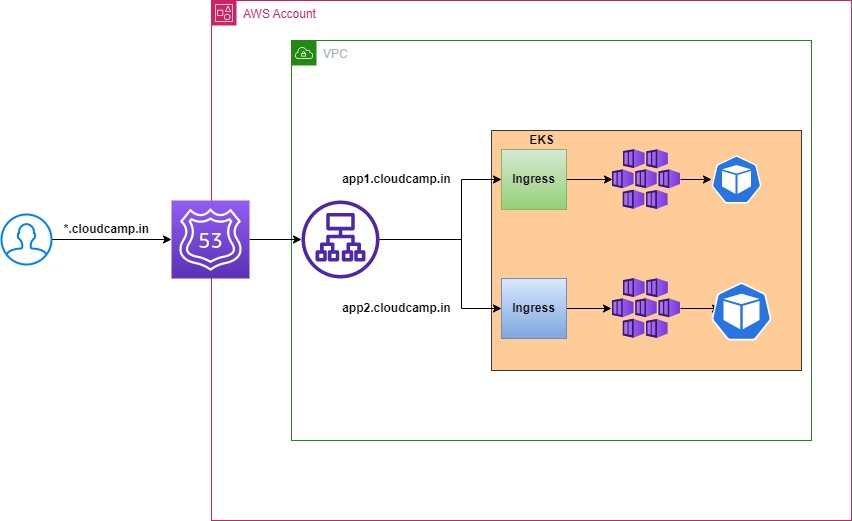

### AWS ALB Ingress Controller

When we setup EKS service of LoadBalancer type, by default it creates Classic ELB which is outdated. AWS prefer to use ALB which is advanced and intelligent.

Earlier every Ingress resource was creating one ALB which will give us huge cost. Later on users request AWS gave us options to maintain single Ingress controller that can be used my multiple projects.



#### Steps

Reference: https://catalog.workshops.aws/eks-immersionday/en-US/services-and-ingress/multi-ingress

Make sure your workstation have Docker, EKS Clients, Helm, etc are installed. Our workstation is on AWS Linux 2.

Docker
```
curl https://raw.githubusercontent.com/techworldwithsiva/docker-install-commands/master/docker-install.sh | sudo bash
```

EKS client Softwares
```
curl https://raw.githubusercontent.com/techworldwithsiva/k8-install/master/eks-client.sh | sudo bash
```
Helm Installation

```
curl -fsSL -o get_helm.sh https://raw.githubusercontent.com/helm/helm/main/scripts/get-helm-3
chmod 700 get_helm.sh
./get_helm.sh
```

1. Create IAM OIDC Provider
```
eksctl utils associate-iam-oidc-provider \
      --region ${AWS_REGION} \
      --cluster ${LAB_CLUSTER_ID} \
      --approve
```
2. IAM policy for AWS Load Balancer controller. This is required by controller pods in kube-system namespace to provision ALB when ingress is applied.

```
curl -o iam-policy.json https://raw.githubusercontent.com/aws-containers/eks-app-mesh-polyglot-demo/master/workshop/aws_lbc_iam_policy.json
```
3. Create IAM policy.
```
aws iam create-policy \
      --policy-name AWSLoadBalancerControllerIAMPolicy \
      --policy-document file://iam-policy.json
```
4. Create IAM Role service account. for AWS Load balancer in kube-system.
```
eksctl create iamserviceaccount \
--cluster=${LAB_CLUSTER_ID} \
--namespace=kube-system \
--name=aws-load-balancer-controller \
--attach-policy-arn=arn:aws:iam::${ACCOUNT_ID}:policy/AWSLoadBalancerControllerIAMPolicy \
--override-existing-serviceaccounts \
--region ${AWS_REGION} \
--approve
```
5. Add EKS helm repo.
```
helm repo add eks https://aws.github.io/eks-charts
```
6. Install AWS Load Balancer controller.
```
helm install aws-load-balancer-controller eks/aws-load-balancer-controller -n kube-system --set clusterName=${LAB_CLUSTER_ID} --set serviceAccount.create=false --set serviceAccount.name=aws-load-balancer-controller
```
7. Verify AWS Load Balancer controller.
```
kubectl get pods -n kube-system
```

### Test using applications